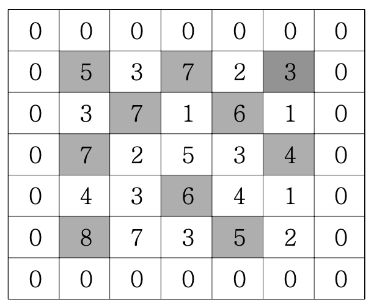

# 봉우리

## 문제 설명
지도 정보가 N*N 격자판에 주어집니다. 각 격자에는 그 지역의 높이가 쓰여 있습니다. 각 격자판의 숫자 중 자신의 상하좌우 숫자보다 큰 숫자는 봉우리 지역입니다. 봉우리 지역이 몇 개 있는지 알아내는 프로그램을 작성하세요.  
격자의 가장자리는 0으로 초기화 되었다고 가정한다.  
만약 N=5 이고, 격자판의 숫자가 다음과 같다면 봉우리의 개수는 10개입니다.  

 

## 입력설명
첫 줄에 자연수 N이 주어진다.(1<=N<=50)
두 번째 줄부터 N줄에 걸쳐 각 줄에 N개의 자연수가 주어진다. 각 자연수는 100을 넘지 않는다.

 

## 출력설명
봉우리의 개수를 출력하세요.

 

## 입출력 예
▣ 입력예제 1  
5  
53723  
37161  
72534  
43641   
87352  
▣ 출력예제 1  
10